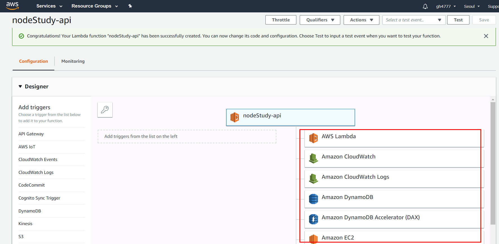

# 10장. 웹 API 서버 만들기.

## 1. API 서버 이해 하기.

API : Application Programming Interface
다른 어플리케이션에서 현재 프로그램의 기능을 사용할 수 있게 허용하는 접점을 의미.

웹 API : 다른 웹서비스의 기능을 사용하거나, 자원을 가져올 수 있는 창구. 흔히 API를 열었따, 만들었다고 표현.

서버에 API를 올려서 URL을 통해 접근할 수 있도록 만든 것을 웹 API 서버라고 한다.

서비스 제공자 입장에서도 주기적으로 크롤링을 당하면 웹 서버의 트래픽이 증가하게 되므로, 웹 서비스를 만들 때 공개해도 되는 자료들은 API로 만들어서 API를 통해 가져가게 하는 것이 좋다.

이번 프로젝트는 NodeBird 서비스와 데이터 베이스를 공유.

## 2. 프로젝트 구조 갖추기.

9장의 NodeBird 서비스와 데이터베이스 공유.


다른 서비스에 NodeBird 서비스의 게시글, 해시태그, 사용자 정보를 JSON 형식으로 제공. 

1. nodebird-api dir 생성.
2. npm init 한 후 package.json 에 있는 것 설치.
3. npm install

사실 템플릿 엔진을 ejs로 해보려다가....포기

4. Nodebird 폴더에서 config, models, passport 폴더 복사해서 넣기.

서버 실행해보기 (nodebird 서버가 돌아가야 실행가능)

여기까지 하고 어차피 json으로 받을 거면 굳이 local로 서버를 하는 거 보다 그냥 aws lambda + api gateway로 json 서버를 만드는게 낫지 않나라는 생각이 들기 시작하여 람다로 삽질좀 하다 옴.

## 3. JWT 토큰으로 인증하기.

JWT = JSON Web Token

세 부분으로 구성되어있는데 다른 곳에서도 쓰이는 개념이므로 알아 두면 좋습니다.

헤더 (Header) : 토큰 정보와 해시 알고리즘 정보.
페이로드 (Payload) : 토큰의 내용물이 인코딩된 정보
인증 (Signature) : 인증수단.

JWT에는 민감한 정보가 들어가서는 안된다.

JWT를 사용하는 이유.

``` $ npm i jsonwebsocket```

.env에 JWT_SECRET 추가


## 4. API 호출 서버 만들기.

제공 서버를 만들었으니, API를 사용하는 호출 서버도 만들어 봅시다. 서버지만 다른 서버에게 요청을 보내므로 클라이언트 역할을 합니다. API 사용자의 입장.

## 5. SNS API 서버 만들기.

## 6. 사용량 제한 구현하기.

일차적으로 인증된 사용자 (토큰을 발급 받은 사용자만) API를 사용할 수 있게 필터를 두긴 했지만,
과도하게 API 서버 사용하지 않기 위해 사용량 제한 구현하기.


## 7. CORS 이해하기

nodebird-call 이 nodebird-api를 호출하는 것은
서버에서 서버로 API를 호출 한 것.

만약 nodebird의 프런트에서 nodebird-api의 서버 API를 호출하면 어떻게 될까.


# 부록. AWS Lambda를 사용하여 json 서버 만들기

api를 서버를 만들거면 그냥 lambda를 쓰는게 짱인 것 같습니다..


람다 펑션 생성.


ROLE을 설정해야 DynamoDB등에 접근 할 수 있음.


처음 node 8로 function을 만들면 async로 작성되어 있는 코드를 볼 수 있습니다.

```
exports.handler = async (event) => {
    // TODO implement
    const response = {
        statusCode: 200,
        body: JSON.stringify('Hello from Lambda!'),
    };
    return response;
};
```

httpRequest > API Gateway + AWS Lambda > DynamoDB

이런 식으로 접근하여 RESTful한 API를 만들어서 JSON 형태의 데이터를 보여주는게 목표.

### 먼저 DynamoDB 생성하여 테스트 DB 넣기.


DB 생성


테스트 DB 넣기.

```
const AWS = require('aws-sdk');
const documentClient = new AWS.DynamoDB.DocumentClient(); 
const params = {
	TableName : process.env.TABLE_NAME
};


exports.handler = async (event) => {
    let response = {}
    response = await documentClient.scan(params).promise()
    const items = response.Items
    return items
};

```

이렇게 하면 return이 dynamoDB 값이 나옵니다.

### API GateWay와 Lambda 연결하기.


api gateway에서 만들어놨던 lambda function 연결.

index.js 수정

```
const AWS = require('aws-sdk');
const documentClient = new AWS.DynamoDB.DocumentClient(); 
const params = {
	TableName : process.env.TABLE_NAME
};


exports.handler = async (event) => {
    let response = {}
    response = await documentClient.scan(params).promise()
    const items = response.Items
    const data = {
        'statusCode': 200,
        'headers': {},
        'body': JSON.stringify(items)
    }
    // 프록시 설정시엔 이런 형식을 맞춰줘야 합니다.
    return data
};
```

이 후 staging 까지 하면 배포.
링크에 들어가면 DB 데이터를 get 하는 api 서버가 됩니다.
(월 100만회 무료..!)

GET 요청을 보내면 DB에 있는 데이터를 받아 올 수 있고
POST 요청을 보내면 데이터를 PUT 할 수 있습니다.
(REST ful 하게 짤 수 있음.)


```
const AWS = require('aws-sdk');
const documentClient = new AWS.DynamoDB.DocumentClient(); 
const params = {
	TableName : process.env.TABLE_NAME
};

exports.handler = async (event) => {
    const operation = event.httpMethod;
    const data = {
    'statusCode': 200,
    'headers': {},
}
    switch (operation) {
        case 'GET':
            let response = {}
            response = await documentClient.scan(params).promise()
            const items = response.Items
            data['body'] = JSON.stringify(items)
            return data
            
        case 'POST':
            let putData = event.body
            params['Item'] = JSON.parse(putData)
            let res = await documentClient.put(params).promise()
            data['body'] = putData
            return data
	        
        default:
            return data
    }

};

```


get으로 접근해서 데이터를 받은 후
post로 데이터 넣고 다시 get으로 접근 하니
데이터가 들어간 것을 볼 수 있습니다.
