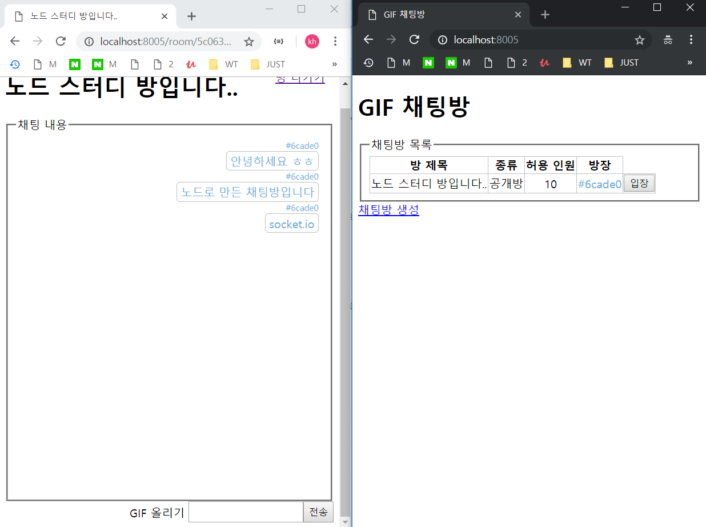
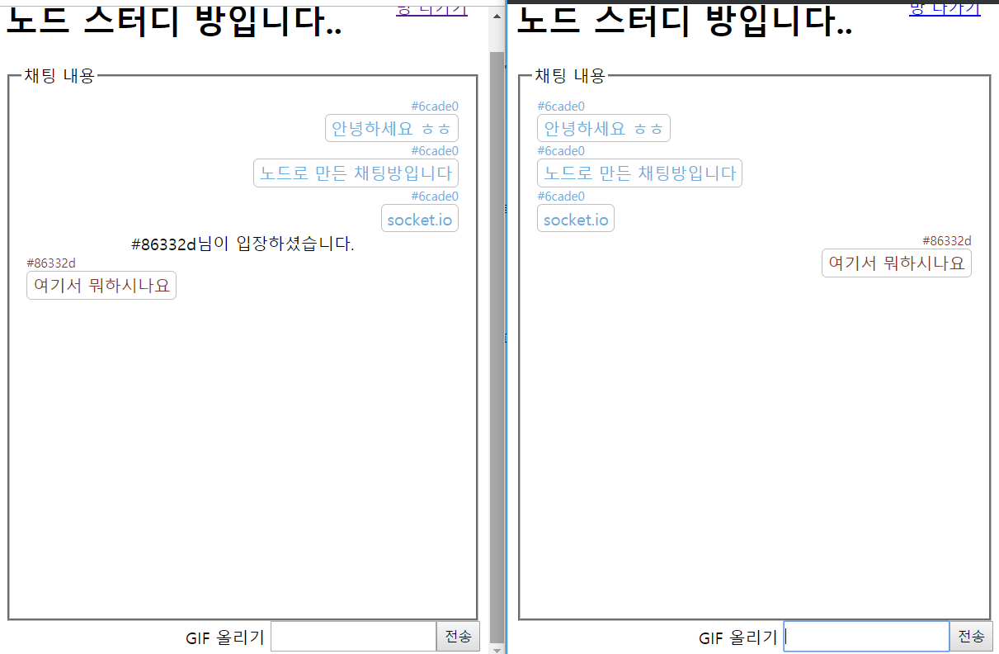

# 11장 웹 소켓으로 실시간 데이터 전송하기

## 1. 웹 소켓 이해하기

Socket.IO 는 웹 소켓을 활용한 라이브러리로 웹 소켓 자체는 아닙니다. 나중에 Socket.IO를 사용하기 위해서는 기반 기술인 웹 소켓(ws)에 대해서 먼저 알아야 한다.

웹 소켓은 HTML 5에서 추가. WS 프로토콜 사용. 실시간 양방향 데이터 전송을 위한 기술. 따라서 브라우저와 서버가 WS 프로토콜을 지원하면 사용 가능. 최신 브라우저는 대부분 웹 소켓을 지원하고, 노드는 ws나 Socket.IO 같은 패키지를 통해 웹 소켓 사용 가능. 웹 소켓은 지속적으로 연결된 라인을 통해 실시간으로 데이터를 주고 받을 수 있음.

웹 소켓 이전에는 폴링(Polling) 이라는 기술로 주기적으로 서버에 새로운 업데이트가 없는지 확인하는 단순무식한 방법.

* SSE : Server Sent Events. 

## 2. ws 모듈로 웹 소켓 사용하기

<실습 파트>

ws 모듈을 사용하여 직접 크롬에서 어떤 식으로 웹소켓 통신이 이루어지는 지 확인하는 것이 목표입니다.

1. 프로젝트 폴더 practice-git-chat 생성
2. npm init 으로 package.json 생성.
3. package.json 복사 붙여 넣기

```

{
  "name": "git-chat",
  "version": "1.0.0",
  "description": "",
  "main": "app.js",
  "scripts": {
    "test": "echo \"Error: no test specified\" && exit 1",
    "start": "nodemon app"
  },
  "author": "",
  "license": "ISC",
  "dependencies": {
    "connect-flash": "^0.1.1",
    "cookie-parser": "^1.4.3",
    "dotenv": "^6.1.0",
    "express": "^4.16.4",
    "express-session": "^1.15.6",
    "morgan": "^1.9.1",
    "pug": "^2.0.3",
    "ws": "^6.1.2"
  },
  "devDependencies": {
    "nodemon": "^1.18.7"
  }
}

```


4. npm i
5. .env 생성하고 COOKIE_SECRET = gifcaht
6. app.js 만들고 작성하기

7. routes 폴더 만들고 index.js 작성하기.
    7.1 index에 send('루트 디렉토리') 작성 후 서버 실행.
    7.2 실행하면 서버가 오류를 반환하는데 과연 무슨 오류일까요?

8. res.send => render(index)로 바꾸고 나머지 진행.
9. npm i ws
10. ws를 express 서버에 연결. app.js 수정합니다.
    10.1 require('./socket')
    10.2 server = app.listen ~
    10.3 webSocekt(server)
11. socket.js 만들고 작성 (이건 복붙)

> socket.js


```
const WebSocket = require('ws')

module.exports = (server) => {
    const wss = new WebSocket.Server({ server })

    wss.on('connection', (ws, req) => {
        const ip = req.headers['x-forwarded-for'] || req.connection.remoteAddress
        console.log('새로운 클라이언트 접속', ip)
        ws.on('message', (message) => {
            console.log(message)
        })
        ws.on('error', (error) => {
            console.error(error)
        })
        ws.on('close', () => {
            console.log("클라이언트 접속 해제", ip)
            clearInterval(ws.interval)
        })
        let number = 1
        const interval = setInterval(() => {
            if (ws.readyState === ws.OPEN) {
                ws.send(`서버에서 클라이언트로 ${number} 번째 메시지를 보냅니다.`)
                number = number + 1 
            }
            
        }, 3000);
        ws.interval = interval
    })
}
```

12. views 안에 index.pug 만들고 서버 실행.

> index.pug

```
doctype
html
    head
        meta(charset='utf-8')
        title GIF 채팅방
    body
        div F12키를 눌러 console 탭과 network 탭을 확인하세요.
        script.
            var webSocket = new WebSocket('ws://localhost:8005')
            webSocket.onopen = function() {
              console.log('서버와 웹 소켓 연결 성공')
            }
            webSocket.onmessage = function (event) {
              console.log(event.data)
              webSocket.send("클라이언트에서 서버로 답장을 보냅니다.")
            }
```

## 3. Socket.IO 사용하기

ws 패키지는 간단하게 웹 소켓 구현시 사용.
구현하고자 하는 서비스가 복잡해지면 Socket.IO 사용.
Socket.IO 에 편의 기능이 많이 추가 되어 있음.


## 4. 실시간 GIF 채팅방 만들기

사람들이 익명으로 채팅할 수 있는 채팅방 생성.
자유롭게 참여하여 GIF 파일을 올릴 수 있는 채팅방.

```
$ npm i mongoose multer axios color-hash
```

DB는 몽구스와 몽고DB를 사용한다.

1. 채팅방 스키마 생성. (room.js)
2. 채팅 스키마 생성 (chat.js)

3. 몽고디비와 연결하는 코드 index.js 수정
4. env에 몽고 아이디와 몽고 비밀번호 입력.

5. app.js 수정
6. layout.pug / main.css / main.pug 작성
7. roomg.pug / chat.pug / socket.js 작성

8. app.js 수정

쭉 책 보고 진행.

## 5. 채팅 구현하기

프론트엔드에서는 서버에서 보내는 채팅 데이터를 받는 소켓 이벤트 리스너가 필요.

1. chat.pug 수정
2. index.js 수정




## 6. 프로젝트 마무리 하기.

