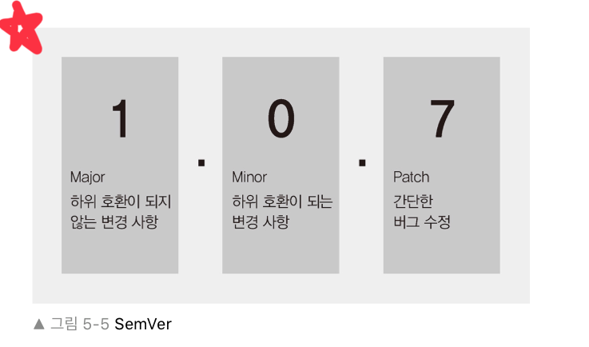

# 5장 패키지 매니저

다른 사람들의 코드를 가져다 쓸 수 있는 모듈
그걸 쉽게 사용하게 해주는 npm.

## 5.1 npm 알아보기.

npm은 Node Package Manager의 약자.
60만개에 달하는 패키지가 등록.
방대한 양의 패키지가 자바스크립트의 생태계를 더욱 견고하게.

npm에 업로드 된 모듈을 패키지 라고 한다.

> yarn
노드의 대체자. 페이스북이 내놓음. npm 서버가 느릴 때 yarn 사용할만 함.

## 5.2 package.json으로 패키지 관리하기.

설치한 패키지의 버전을 관리하는 파일이 바로 package.json

``` npm init ```

npm을 시작하기 위해 쓰는 명령어
scripts 부분은 npm 명령어 저장해두는 부분.
npm run 명령어 입력하면 해당 스크립트 실행.

``` npm run test ```

패키지를 설치하기 위한 명령어

``` npm install express ```

설치하고 나면 dependencies와 함께
package.json에 추가 된다.

> --save 패키지 이름을 추가하는 옵션이지만 npm 5 부터는 기본값으로 설정되어 따로 안해도 된다.

이 후 폴더 안에 node-modules이 생기며 여기 안에
express 패키지와 express의 의존성 패키지가 모두 설치되어있습니다.

package-lock.json은 이 의존성 정보들이 담김.

모듈 여러개 설치.

```npm install [패키지1] [패키지2] [패키지3]```

개발용 패키지중 하나인 nodemon.
소스 코드가 바뀔 때 마다 자동으로 노드 재실행!

```npm install --save-dev nodemon ```

package.json 의 
devDependencies 부분은 개발용 패키지만 따로 관리.

방금과 같은 것들은 현재 폴더에만 설치되었지만,
npm 이 설치되어있는 폴더에 전역으로 설치 가능.

``` npm install --global rimraf ```

윈도우에서 리눅스의 rm -rf 명령어 사용하게 해주는 모듈

``` rimraf node_moduels ```

하면 node_moduels 폴더 삭제됨.
모듈 패키지가 사라져도 package.json이 남아있기에
다시 npm install 만 하면 알아서 설치된다.
따라서 node_modules 커밋하지 않고
그냥 package.json만 커밋하는 것!

npm install > npm i 로 줄여쓰기 가능.

## 5.3 패키지 버전 이해하기

노드 패키지들의 버전은 항상 세자리.
노드의 버전도 세자리 인데 SemVer 방식의 버전 넘버링을 따름. 패키지 버전 번호를 어떻게 정하고 올려야 하는지 명시하는 규칙.



Major , Minor , Patch를 따름.

새 버전을 배포한 후에는 그 버전의 내용 절대 수정하지 않는 것. 만약 수정사항이 생기면 역시 룰에 따라서 수정한 후 업데이트 된 버전으로 배포해야 한다. 그래야만 같은 버전을 사용할 때 어떠한 경우라도 정상적으로 작동한다는 믿음.

## 5.4 기타 npm 명령어

npm outdated 명령어로 업데이트 할 수 있는 패키지가 있는지 확인 할 수 있다.

``` npm update ``` 
업데이트 가능한 모든 패키지 업데이트

``` npm uninstall [패키지명] ``` 
해당 패키지 제거
node_modules 과 package.json에서 모두 사라짐.
=> npm rm [패키지명] 으로도 가능

``` npm search [검색어] ```
npm 패키지 검색 가능.

``` npm info ```
패키지의 세부 정보 파악. 의존관계등 나와있음.

``` npm adduser ```
npm 로그인을 위한 명령어. npm 공식 사이트 계정 로그인.
나중에 패키지 배포시 로그인 필요.

``` npm whoami ```
로그인한 사용자가 누군지 알려줌.

이외의 명령어는 <a herf ="https://docs.npmjs.com/"> npm 공식 문서 참고. </a>

## 5.5 npm 패키지 배포하기.

웹 사이트에서 sign up 후 콘솔에서 npm adduser 하여 로그인.

package.json의 main 부분과 파일명이 일치해야함!

이후 npm publish 명령어를 사용하여 배포.

* 패키지 이름 겹치는 것으로 사용 불가.

이후 npm info [패키지명] 으로 확인.
24시간 전에만 삭제 가능.

npm unpublish [패키지명] --force

* npm 배포시 항상 개인정보 확인하기.

