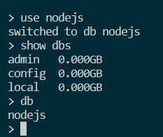
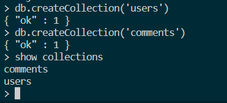
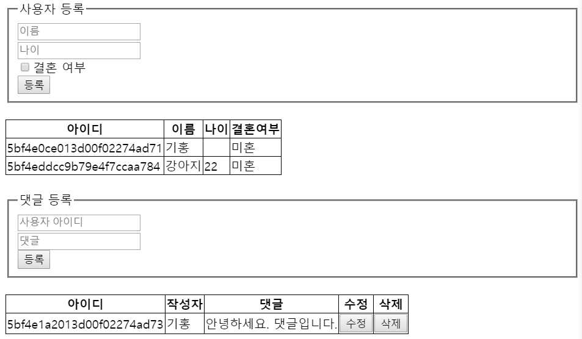
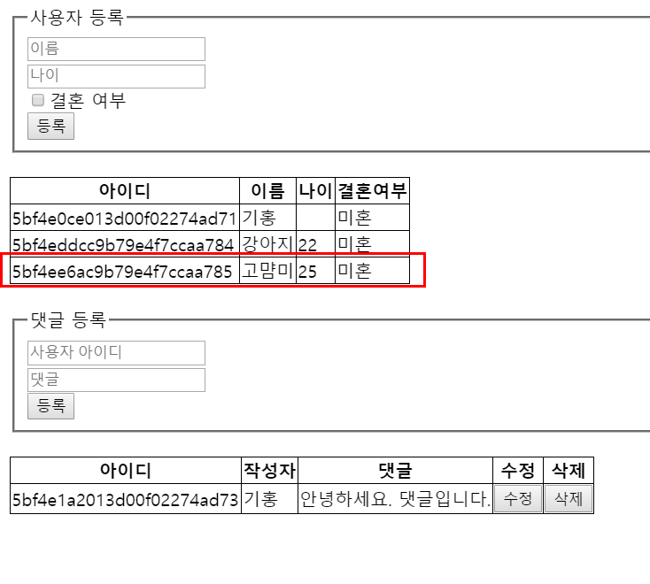
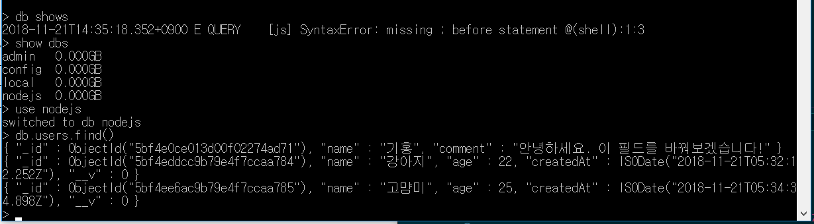

# 8장 몽고디비

몽고디비의 특징중 하나는 자바스크립트 문법을 사용한다는 것.
흔히 사용되는 RDBMS가 아니라 특색이 뚜렷한 NoSQL이다.

## 8.1 NoSQL vs SQL

MySQL은 SQL을 사용하는 대표적인 데이터베이스.
SQL을 사용하지 않는 NoSQL(Not only SQL)의 대표주자 몽고디비.


NoSQL은 고정된 테이블이 없음! MySQL은 users 테이블을 만들때
필요한 컬럼과 자료형, 옵션을 정의하지만 몽고디비는 그냥 users 컬렉션
만들고 끝. JOIN 기능 없음. 하나의 쿼리로 여러가지 테이블 합치는 작업.

여러가지 안되는 기능들이 있지만 몽고디비를 사용하는 이유는
확장성과 가용성. 데이터를 빠르게 넣고 쉽게 여러 서버에 분산 가능.

많은 기업들이 SQL과 NoSQL을 동시에 사용하고 있습니다.

## 8.2 몽고디비 설치하기


### 윈도우

https://www.mongodb.com/download-center/community
에서 다운로드 가능. zip이 아니라 msi로 다운. 

몽고디비 AS a Service 체크 해제하고 설치해봄.

이후 C:\Program Files\MongoDB\Server\4.0\bin 에서 mongod 실행해야함.
(서버 실행)

몽고 디비 프롬프트에 접속하려면 같은 폴더에서 mongo 명령어 입력.
또는 mongo 실행.

> 콘솔

cd C:\Program Files\MongoDB\Server\4.0\bin
mongod
(서버 시작)

추가 콘솔 실행
cd C:\Program Files\MongoDB\Server\4.0\bin
mongo

> 윈도우 탐색기

C:\Program Files\MongoDB\Server\4.0\bin
들어가서 mongod 이후 mongo 실행.

### mac OS

homebrew를 이용해 설치.


### 우분투

apt-get 을 이용해서 설치.

역시 설치후 mongod > mongo 순서로 실행


## 8.3 컴퍼스 설치하기

몽고디비는 관리 도구로 컴퍼스를 제공.
컴퍼스도 몽고디비 <a href="https://mongodb.com/download-center#compass">공식 사이트</a>에서 다운로드 가능

### 윈도. 몽고디비 설치시 같이 설치

### mac OS

공식 사이트에서 다운로드 가능.


### ubuntu

GUI를 사용하지 않아 컴퍼스를 설치하지 않고
몽고디비 프롬프트 사용.


> 저는 컴퍼스를 깔았는데 보이지 않습니다..


## 8.4 데이터 베이스 및 컬렉션 생성하기

nodejs 이름의 데이터 베이스 생성하기.

``` use nodejs ```



``` db.createCollection('user') ```



> 추가 명령어

``` show dbs ```

``` show collections ```


## 8.5 CRUD 작업하기

몽고디비에서 CRUD 작업하기.

### Create (생성)

NoSQL의 장점인 컬럼을 정의하지 않아도 되므로
컬렉션에 아무 데이터나 넣을 수 있다.

``` use nodejs ```

``` db.users.save({}) ```
딕셔너리 형태로 집어넣으면 된다.

db.[collectionName].[명령어]

### Read (조회)

``` db.users.find({}) ```

{name:'기홍'} 넣으면 그에 해당하는 데이터 찾음.


``` db.users.find({} ,{name :1}) ```
두번 째 인자 넣으면 특정 필드만 조회 가능.

조회시 조건 줄때

* $gt
* $gte
* $lt
* $lte
* $ne
* $or
* $in

등을 넣어서 조건 넣을 수 있음.

find().sort() 사용하면 정렬도 가능.
.limit() 개수 제한.

### Update (수정)

``` db.users.update({name:'기홍'} , {$set : {comment: '안녕하세요. 이 필드를 바꿔보겠습니다!' } }) ```

$set이라는 연산자가 사용. 이 연산자를 사용하지
않고 일반 객체를 넣는다면 통채로 바뀌며 이 연산자를 사용하면, 일부만 수정된다.

### Delete (삭제)

``` db.users.remove({name:"강아지"}) ```


보통 작업 시 mongodb 콘솔 창에서
작업하는 일은 많이 없지만 알아 둬야 하는 부분.


## 8.6 몽구스 사용하기.


MySQL에 시퀼라이즈가 있다면 몽고디비에는 몽구스가.
ODM 이라고 불린다. (Object Document Mapping)
Relation(관계)가 아니라 다큐먼트를 사용하므로.
ORM이 아니라 ODM.

불편한 기능들을 몽구스가 보완해준다.

* 스키마 (Schema)
자료형 설정 후
몽구스는 몽고디비에 데이터를 넣기전
데이터를 한 번 필터링 해주는 역할을 한다.

JOIN 기능도 populate 라는 기능으로 보완.

### 몽구스 시작하기 

``` express learn-mongoose --view=pug ```

``` cd learn-mongoose && npm i ```

learn-mongoose 폴더에
schemas 폴더를 만든 후 index.js 만들기.

> 이때 환경변수로 mongo를 사용할 수 있어야 오류가 안뜹니다.

이 후 app.js에 

``` var connect = require('./schema')  ```
``` connect()  ```

넣어 준 후 npm start 했을 때 오류가 안뜨면 됩니다.

### 스키마 만들기.

user.js
comment.js


### 쿼리 수행하기.

1. views/mongoose.pug 만들기

2. public/mongoose.js 만들기

<a href='https://github.com/ZeroCho/nodejs-book/tree/master/ch8/8.6/learn-mongoose'> 제로초님 블로그 참고 </a>

3. routes/index.js

4. routes/user.js

5. routes/comments.js

6. app.js 수정



수정 완료한 후 npm start 후 서버 들어갔을 때 초기.



웹을 통해서 새로운 DB data 생성.



db 콘솔 들어가서 실제로 만들어졌는지 확인.