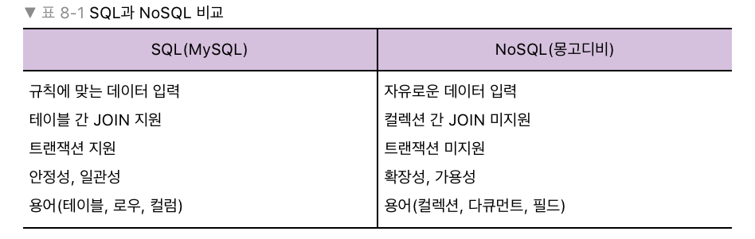

# 8장 몽고디비

몽고디비의 특징중 하나는 자바스크립트 문법을 사용한다는 것.
흔히 사용되는 RDBMS가 아니라 특색이 뚜렷한 NoSQL이다.

## 8.1 NoSQL vs SQL

MySQL은 SQL을 사용하는 대표적인 데이터베이스.
SQL을 사용하지 않는 NoSQL(Not only SQL)의 대표주자 몽고디비.

NoSQL은 고정된 테이블이 없음! MySQL은 users 테이블을 만들때
필요한 컬럼과 자료형, 옵션을 정의하지만 몽고디비는 그냥 users 컬렉션
만들고 끝. JOIN 기능 없음. 하나의 쿼리로 여러가지 테이블 합치는 작업.

여러가지 안되는 기능들이 있지만 몽고디비를 사용하는 이유는
확장성과 가용성. 데이터를 빠르게 넣고 쉽게 여러 서버에 분산 가능.

많은 기업들이 SQL과 NoSQL을 동시에 사용하고 있습니다.

## 8.2 몽고디비 설치하기

### 윈도우

https://www.mongodb.com/download-center/community
에서 다운로드 가능. zip이 아니라 msi로 다운. 

몽고디비 AS a Service 체크 해제하고 설치해봄.

이후 C:\Program Files\MongoDB\Server\4.0\bin 에서 mongod 실행해야함.
(서버 실행)

몽고 디비 프롬프트에 접속하려면 같은 폴더에서 mongo 명령어 입력.
또는 mongo 실행.

> 콘솔

cd C:\Program Files\MongoDB\Server\4.0\bin
mongod
(서버 시작)

추가 콘솔 실행
cd C:\Program Files\MongoDB\Server\4.0\bin
mongo

> 윈도우 탐색기

C:\Program Files\MongoDB\Server\4.0\bin
들어가서 mongod 이후 mongo 실행.

### mac OS

homebrew를 이용해 설치.

### 우분투

apt-get 을 이용해서 설치.

역시 설치후 mongod > mongo 순서로 실행

## 8.3 컴퍼스 설치하기

## 8.4 데이터 베이스 및 컬렉션 생성하기

## 8.5 CRUD 작업하기

## 8.6 몽구스 사용하기.

