# 9장 익스프레스로 SNS 서비스 만들어보기

8장까지의 배운 것을 바탕으로 실제 웹 서비스 구축. 프로미스 보다 async/await 문법을 적극 사용할 것이라고 권장하시나 async/await 문법을 아직까진 잘 모르겠습니다.

1. root 폴더 생성 (폴더 이름 : nodebird)
2. npm init

필요한 모듈 설치 시작.

``` 
$ npm i -g sequelize-cli 
$ npm i sequelize mysql2 
$ sequelize init 
```

실행시 config, migrations, model, seeders 폴더 생김
이 후 템플릿파일을 넣을 views 라우터를 넣을 routes
정적파일을 넣을 public 폴더 생성.

1. views dir 생성
2. router dir 생성
3. public dir 생성.

9.3절에서 설명할 passport 패키지를 위한 passport까지 생성.

4. passport dir 생성.

여기까지 폴더가 완성됐다면 폴더 구성은 끝!

이 후 필요한 모듈 추가 설치.

``` 
$ npm i express cookie-parser express-session morgan connect-flash pug
$ npm i -g nodemon
$ npm i -D nodemon 
```

서버 코드에 수정 사항이 생길때 마다 매번 서버를 재시작 하기 귀찮으므로 nodemon 모듈로
서버를 자동 재시작하는 코드를 작성. 서버 코드 수정시 알아서 자동으로 서버 재시작 합니다.

nodemon은 개발용으로만 사용할 것을 권장. 배포 후에는 서버 코드가 빈번하게 수정될 일이 많이 없으므로.

### app.js 작성하기

한번 쯤 다 쳐보는 게 좋을 듯. 저도 js 파일들은 전부 타이핑 했고 레이아웃, CSS 정도만 복붙!
6장에서 배운 미들 웨어 대부분을 사용합니다.

* 이제부터 비밀키 들은 하드 코딩 하지 않으며 이를 위한 모듈로 dotenv를 설치하고 관리합니다.

``` $ npm i dotenv ```

이후 .env 파일을 생성 한 후 거기에 키 = 값 형식으로 비밀키를 추가. 이 후 app.js에서 비밀키를 불러옵니다. 

``` require('dotenv').config() ``` 

앞에서 작성한 'nodebirdsecret' 을 process.env.[키] 로 수정

### 기본적인 router 작성하기.

1. route/page.js 타이핑.

express를 호출 한 뒤에 router를 호출 하고 
이후 모듈 export 한 후에
app.js에서 이 모듈을 불러오는 식으로 모듈화합니다.

서버가 잘 구동 되는 지 router를 만들고
각 router에 join, index 등에 응답 값으로
'테스트' 값을 보내보고 서버를 실행합니다.

여기까지 router를 만들고 res.send('테스트') 하기.


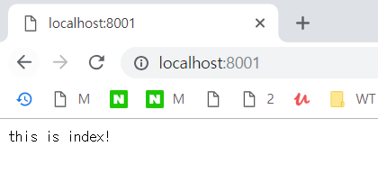
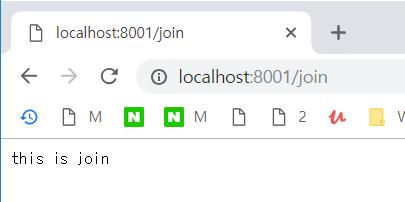


여기까지 하면 대충 서버가 돌아가는 것 세팅은 됐고
템플릿과 프론트 엔드 단은 제로초 님 깃허브에서 복사하기.

https://github.com/ZeroCho/nodejs-book/tree/master/ch9/9.1/nodebird/views

여기서 전부 복사하면 됩니다.

1. views/layout.pug 생성
2. views/main.pug 생성
3. views/profile.pug 생성
4. views/join.pug 생성
5. views/error.pug 생성

6. public/main.css 생성

위에서 서버 구조는 대충 만든 상태에서 이제
템플릿과 css만 한거기 때문에 간단히 복 붙으로 해결.

6번까지 완성하면 다음과 같은 화면

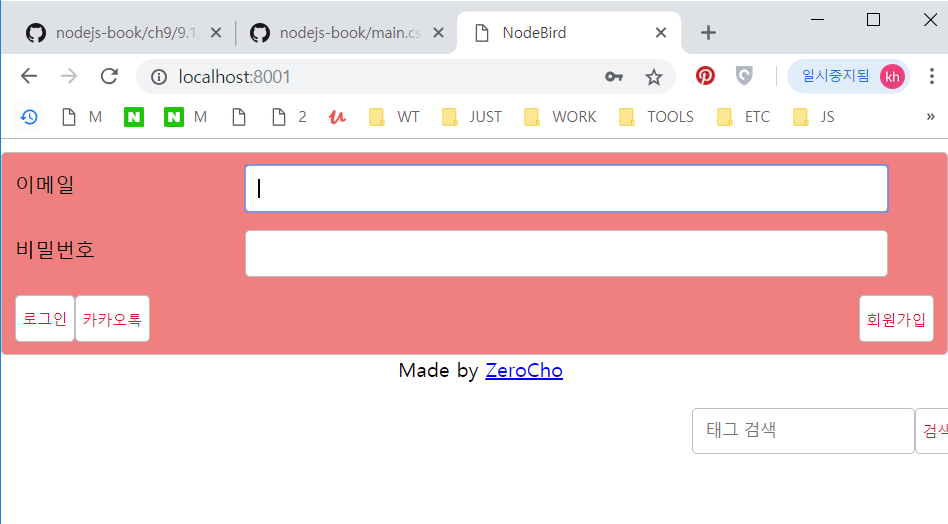

## 9.2 데이터 베이스 세팅하기

models 폴더 안에 3가지 파일 생성

1. models/user.js
2. models/post.js
3. models/hashtag.js

이렇게 생성한 모델들을 sequelize에 등록. index.js를 수정하여 각 모델 초기 설정.

이 후 데이터베이스를 생성 하기 위해서 데이터베이스의 config를 수정.

1. config/config.js
에서 development의 db 비밀번호 수정.

수정 이후 데이터 베이스 생성.
콘솔 창에서 아래 명령어 입력.

``` $ sequelize db:create ```

> config.json 에서 password를 스트링으로 작성해야. 그냥 숫자로 넣었다가 오류.

데이터베이스를 생성하는 것을 완료했으니,
모델을 서버와 연결 합시다. (app.js 수정)

연결한 후에 npm start 하면 테이블을 자동으로 생성합니다.(최초)

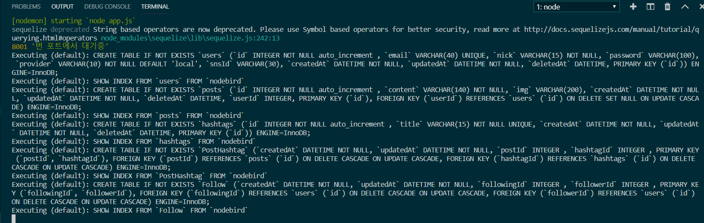

여기까지 db를 만들고, 시퀼라이즈를 통해 db를 node.js에 연결하는 것 까지 완성 되었습니다.

## 9.3 패스포트 모듈로 로그인 구현하기.

패스포트 모듈은 회원가입과 로그인을 구현해주는 모듈. 로그인과 회원가입등을 직접 구혀낳ㄹ 수도 있지만, 세션과 쿠키 등 복잡한 처리 과정이 많으므로 검증된 서비스를 이용합시다. > passport module.

패스포트 모듈은 SNS login 기능 까지 제공합니다.

passport 관련 모듈 설치

``` $ npm i passport passport-local passport-kakao bcrypt ```

이후 app.js에 passport 모듈 연결하기. 
(먼저 연결 해놓고 모듈은 추후 작성.)
연결 후에 passport 모듈 작성하기 (passport/index.js)

패스포트 일련의 과정을 이해하기.

1. 로그인 요청
2. passport.authenticate 메서드 호출
3. 로그인 전략 수행
4. 로그인 성공 시 사용자 정보 객체와 함께 req.login 호출
5. req.login 메서드가 passport.serializeUser 호출
6. req.session 에 사용자 아이디만 저장
7. 로그인 완료


### 로컬 로그인 구현하기.

로컬 로그인이란 sns 서비스를 통해 로그인 하지 않고
자체적으로 회원가입 후 로그인 하는 것.
passport를 통해 구현하려면 passport-local이 필요합니다.

회원가입, 로그인, 로그아웃 라우터 만들기.
각 라우터에는 접근조건이 존재합니다.
ex) 로그인되어 있는 사람은 회원가입에 접근이 안됨.
ex) 로그인되어 있는 사람은 로그인 라우터에 접근이 안됨. 등 

따라서 라우터에 접근 권한을 제어하는 미들웨어가 필요하다.
미들웨어를 만들어보면서 isAuthenticated 메서드에 대해 알아봅시다.

1. middleware.js 작성
여기서 쓰이는 isLoggedIn 모듈이 아주 직관적이고 이 모듈을 쓰면서 미들웨어의 편리성에 대해 감탄.. 라우팅 시 미들웨어로 하나만 넣어주면 되니까 편리.
2. page.js 작성
3. routers/auth.js 작성
4. passport/localStrategy.js 작성

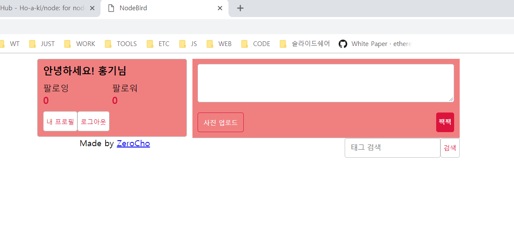


### 카카오 로그인 구현하기

1. passport/kakaoStrategy.js 작성
2. routes/auth.js 작성.
3. auth.js를 app.js에 연결. autoRouter = require('/router/auth)

이후 카카오 개발자 센터에서 앱만들고 
api 키를 .env에 넣어줍니다.

세팅을 다했으나.. Debugging....

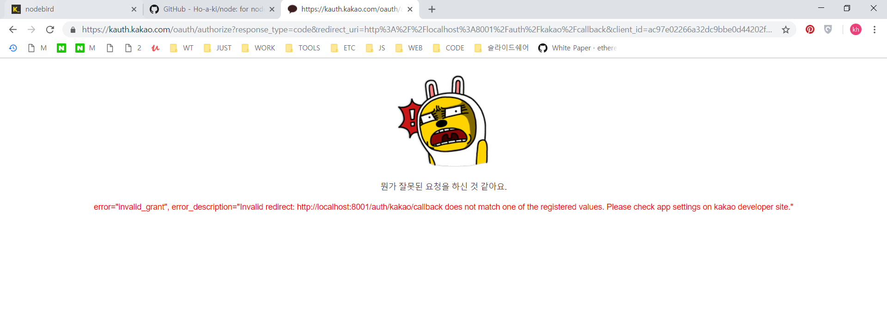

첫번째 오류.
카카오에서 앱 등록할 때 URL 수정. 
oauth > auth로 수정해주면 됩니다.

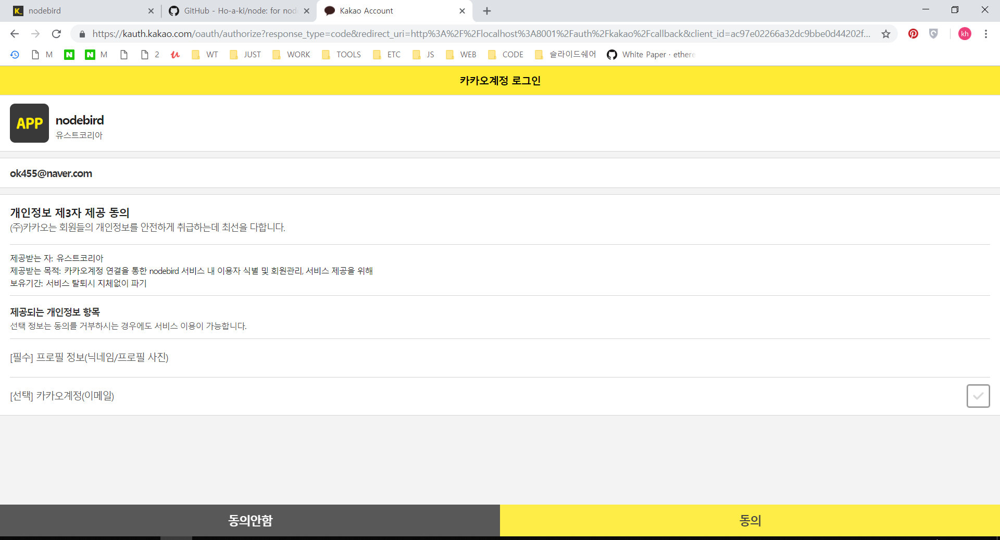

수정해주니 넘어갔지만 로그인이 안됨.

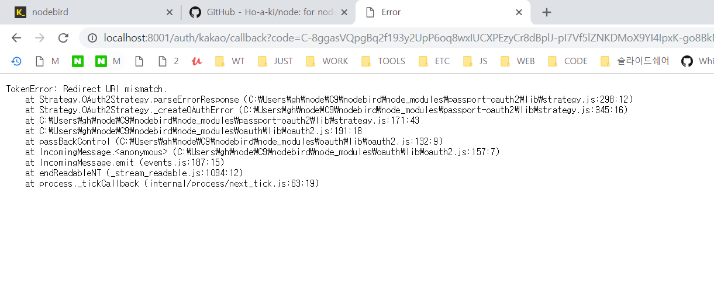

왜 또 오류가 뜨는 것일까..

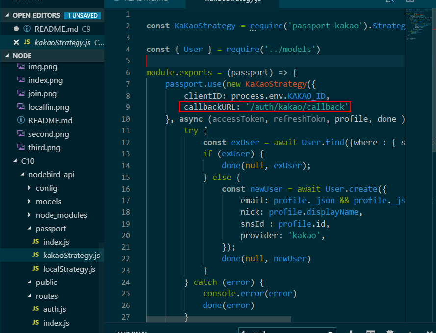

찾아보니까 URL에서 오류가 떴었음.


## 9.4 Multer 모듈로 이미지 업로드 구현하기

``` $ npm i multer ```
이미지 모듈 설치 및 불러오기.

1. router/post.js 작성
2. router/page.js 수정

여기까지 만들고 서버 실행하면 post 작동 안하니
뒤에 부분까지 마무리!

## 9.5 프로젝트 마무리하기.

이미지 업로드까지 완성되었으나, 이제 해시태그 검색 기능과 팔로잉만 추가하면 끝.

1. router/post.js 수정
2. router/user.js 수정
3. passprt/index.js 수정
4. app.js 수정

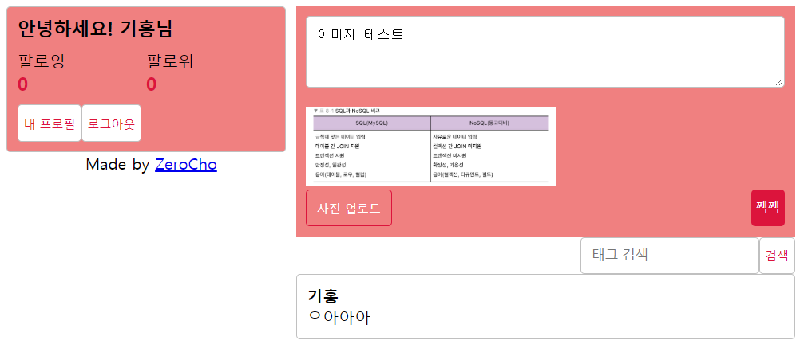
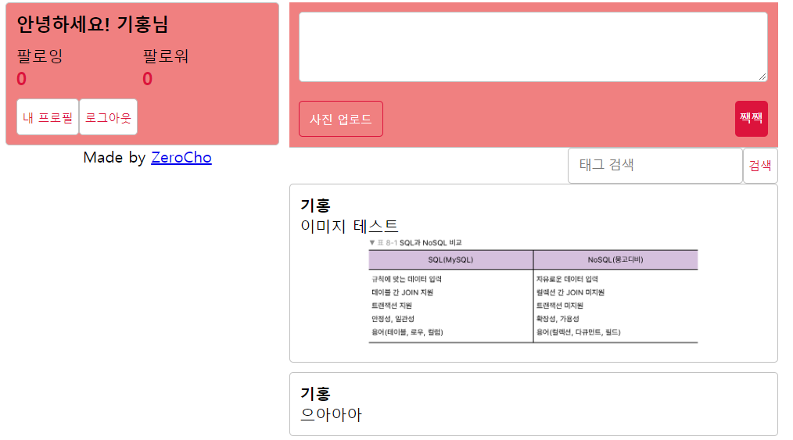

## 스스로 해보기

한번 해보는 것도 좋을거 같습니다.